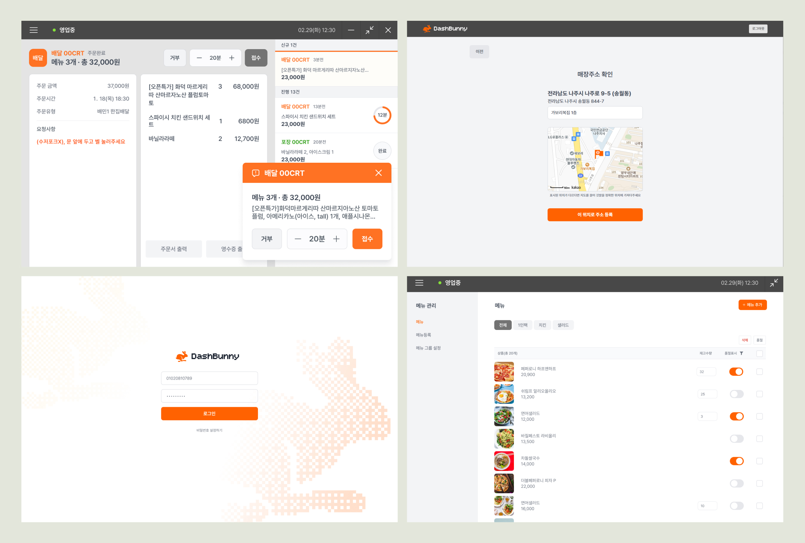
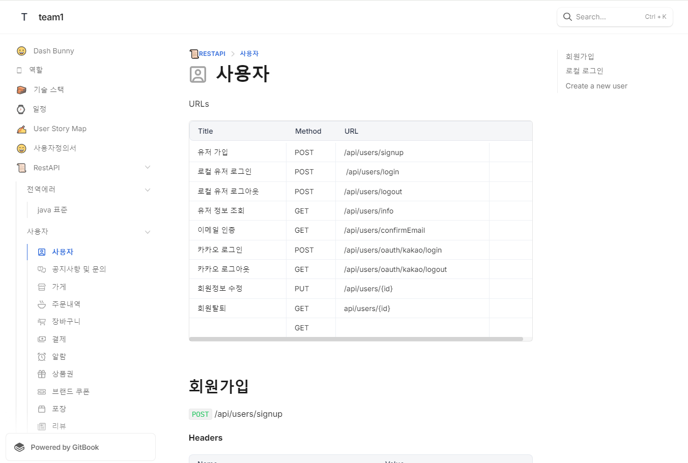
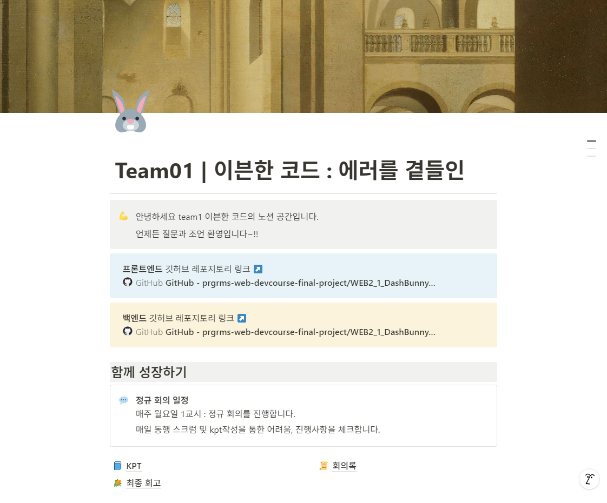
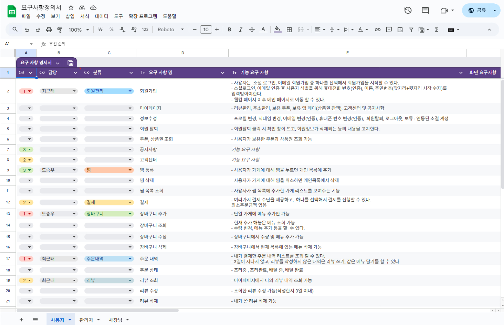
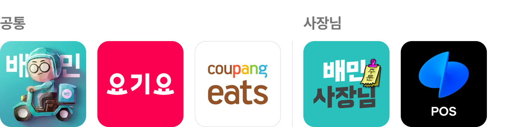
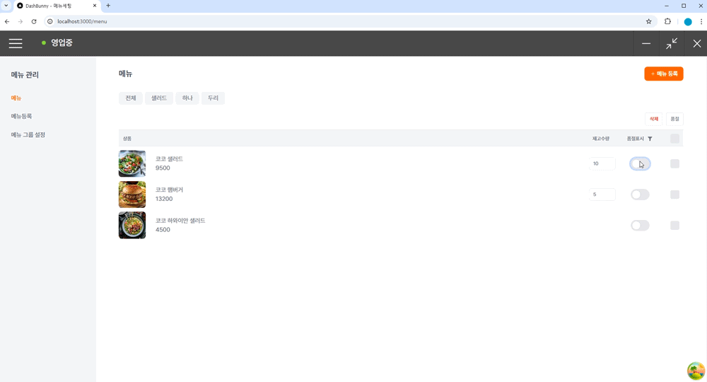

직관적인 UX와 숏츠 기반 메뉴 탐색으로 소비자와 생산자를 연결하는 음식 배달 플랫폼

 

### 작업기간 

2024/11/15 ~ 2024/12/9

## 기획문서

전체 프로젝트 기획서(Gitbook)

[🔗 GitBook 바로가기](https://team1-4.gitbook.io/team1)

프로젝트 노션

[🔗 Notion 바로가기](https://neul.notion.site/Team01-159dc69321d780c98a89d9b62f3a597f?pvs=4)

유저 스토리

유저스토리는 소비자와 관리자/사장님 두 그룹으로 나누어 작성하였습니다. 각 플랫폼의 유저 니즈와 핵심 기능을 연계하여, 구현해야 할 기능의 우선순위를 체계적으로 고려하였습니다.

  

요구사항 명세서

[🔗 요구사항 명세서 바로가기](https://docs.google.com/spreadsheets/d/1SIp4nXwJ0ElFOywPJW0efp9M_8tOnuo6Mcc7AePjCrI/edit?usp=sharing/)

FIGMA

[🔗 FIGMA 바로가기](<https://www.figma.com/design/2tK4q9q0Tj8ekFfGMZC77K/FE2-4%EC%B0%A8-%ED%94%84%EB%A1%9C%EC%A0%9D%ED%8A%B8-%ED%99%94%EB%A9%B4%EA%B8%B0%ED%9A%8D%EC%84%9C_1118(%EC%99%B8%EB%B6%80%EB%85%B8%EC%B6%9C%EC%9A%A9)?node-id=1-3&t=EaPrvldFNMvwYRRS-1>)

?node-id=1-3&t=EaPrvldFNMvwYRRS-1>)

## Skills

 

## 📌서비스 소개 및 기획의도

### 개요

**Dash Bunny**는 친근한 배달원 캐릭터 '토끼'를 활용하여 빠르고 효율적인 딜리버리 서비스를 제공하는 프로젝트입니다.
이 중 사장님 도메인은 사장/종업원이 가장 자주 사용하는 포스기 화면에 최적화된 UX/UI를 설계하는 것을 목표로 했습니다.
기존 배달의 민족 서비스가 포스기와 모바일 화면으로 분할된 구조였다면, 사장님 도메인은 포스기에서 모든 기능을 빠르고 직관적으로 관리할 수 있도록 설계하여, 운영의 효율성을 극대화했습니다.

### 벤치마킹

본 프로젝트 시스템은 배달의 민족 플랫폼을 벤치마킹하여 설계되었습니다. 다양한 배달 플랫폼의 장점들을 분석하고 통합하여, 사용자 중심의 UX/UI를 구현하는 데 초점을 맞추었습니다. 이를 통해 직관적이고 편리한 사용자 경험을 제공하고자 노력하였습니다.

## 작업 관리

일정

협업방식 - 이슈보드

 

## 주요 기능

### 가게 등록

- 신규 가게의 기본 정보(매장명, 사업자등록증, 업종, 매장 주소)를 입력하는 폼을 구현
- 단계별 입력(Step UI) 방식을 적용하여 한 번에 하나의 입력만 요구, 사용자가 직관적으로 정보를 입력할 수 있도록 개선
- 매장 주소 입력 시 행안부 도로명 주소 API와 Kakao 지도 API를 활용, 지도 드래그 방식으로 정확한 위치(위도·경도)를 입력할 수 있도록 설계

 

### 메뉴 관리

- 가게의 메뉴 추가/품절/삭제가 가능한 관리 페이지
- 전체 메뉴를 기본으로 불러오며, 카테고리 선택 시 해당 카테고리의 메뉴만 필터링하여 표시
- 메뉴명, 가격, 재고 수량, 품절 여부를 한눈에 확인 가능하도록 UI 최적화
- 배달업장 특성상 신속한 업데이트가 필요하여 일괄 품절 및 일괄 삭제 기능을 제공, 운영의 효율성을 극대화